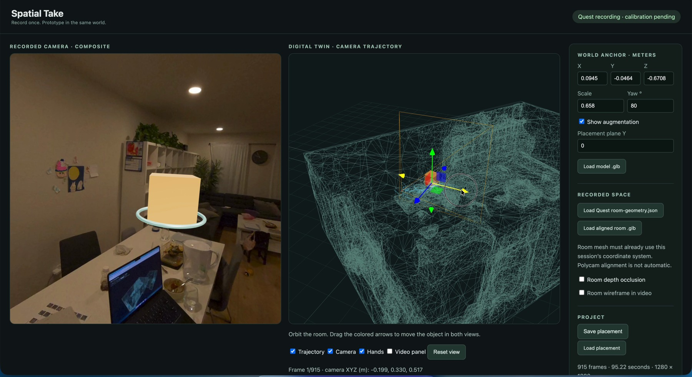
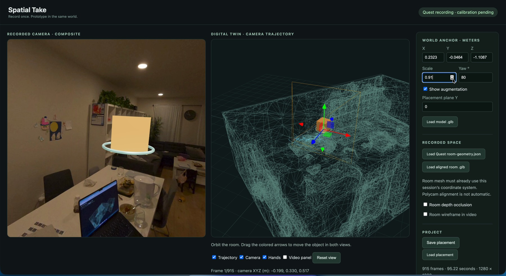

# Recorded-video ↔ 3D editor interaction

The desktop editor uses **one editable Three.js object transform** in two views:

- **Recorded camera / composite:** source images rendered with their logged sensor-camera poses and intrinsics.
- **Digital twin:** an independently orbitable scene with recorded camera trajectory, camera frustum, and the same object.

This is an implemented browser interaction, not a simulated editor video. Moving, scaling or rotating the object updates both panes immediately. Source pixels are unchanged; the composite is rerendered in the browser.

## Latest daily-demo screen recording

These two frames come from Ryo's actual screen recording shared in [#daily-demo](https://programmable-reality.slack.com/archives/C08RK4K26AV/p1791002447977319) on October 2, 2026. Both show **source frame 1/915**. Between the screenshots, object translation and scale change in both the recorded-camera composite and the 3D twin.

**Before — screen recording at 2 seconds**



**After — screen recording at 10 seconds**



These stills illustrate the shared placement controls. They do not measure response latency or physical registration accuracy. The browser chrome is cropped; the application views are retained. [Image provenance](figures/README.md)

## Run with your private recording

From `editor/`, install dependencies with `npm ci`, then run `npm start`. Open:

```text
http://127.0.0.1:8766/?session=sessions/quest-215403/session.json
```

Private recordings and generated sessions are intentionally not published in Git. Substitute the path to an imported session on your machine.

1. Pause at a useful frame.
2. Set **Placement plane Y** to the intended horizontal surface height, then click the video to place the object. This is an authored plane constraint, not an automatic surface detector.
3. Edit **X / Y / Z**, **Scale**, or **Yaw**, or drag the colored translation handles in the digital twin. Both views use the same object.
4. Scrub the timeline. The video image and recorded camera pose advance together; the world-space object stays fixed.
5. Orbit the twin independently to inspect placement and camera trajectory.
6. Use **Save placement** to download the editable state. **Load placement** restores it; imported GLBs are embedded in the state.

A saved project can also be opened with a same-server `&placement=path/to/placement.json` URL parameter.

A new model can be loaded with **Load model .glb**. Room geometry must already be in the recording's coordinate system. **Room wireframe in video** is off by default to keep the source readable; the twin still shows the room. This toggle is independent of depth occlusion and is saved with the placement. Enable room depth occlusion only after verifying that registration against visible walls and surfaces. A room wireframe or successful numerical projection alone does not prove physical alignment.

## Reproduce the interaction recording and checks

With the HTTP server running:

```sh
EDITOR_URL='http://127.0.0.1:8766/?session=sessions/quest-215403/session.json' \
DEMO_OUT='/tmp/openclaw/editor-interaction' \
node scripts/capture-editor-interaction.mjs
```

Requires Playwright, local Google Chrome, and `ffmpeg`. `CHROME_PATH` can select another Chrome executable. The script performs actual input interactions in the existing editor and exports 600 fixed-size 1600 × 1000 screenshot frames as `editor-interaction-polished.mp4` (25 seconds at 24 fps), with a saved `placement.json`. The viewport does not resize or switch between incompatible capture dimensions. Presentation timing is deliberately paced; this is not a wall-clock screen recording or a latency benchmark. `verification.json` records the source URL, source frame count and duration, assertions, and limitations.

The room display smoke test can also be run with `TEST_URL=http://127.0.0.1:8766/ node scripts/editor-room-display-smoke.mjs`. It verifies the default no-color/no-depth behavior, independent twin visibility, depth-only occlusion, and state round-trip.

Checks include:

- Editing the actual X input changes the composite canvas pixels and shared anchor position at the **same recorded timestamp** (captions are excluded from the pixel comparison).
- Visibility removes the actual Three.js augmentation.
- Timeline changes preserve authored placement.
- No browser page errors.
- Saving through the real download button produces placement JSON.

The capture's initial object location is deliberately authored in front of a recorded viewpoint to make editing visible. It is **not** claimed to be a measured tabletop placement. Video captions are capture-only annotations, not additional editor features.

## Evidence boundaries

The editor supports interactive desktop authoring over recorded footage. This paced screenshot export demonstrates those actual controls and resulting renders, not measured real-time playback smoothness or response latency. The source recording contains approximately 9.6 unique frames per second; a 24 fps export does not create additional captured observations. It does not establish automatic object tracking, hand-driven events, physical calibration accuracy, live passthrough deployment, or headset WebXR behavior. Hand logs and room geometry are separate inputs with their own validity and timing requirements. XR controller interaction exists but requires a separate headset test.
