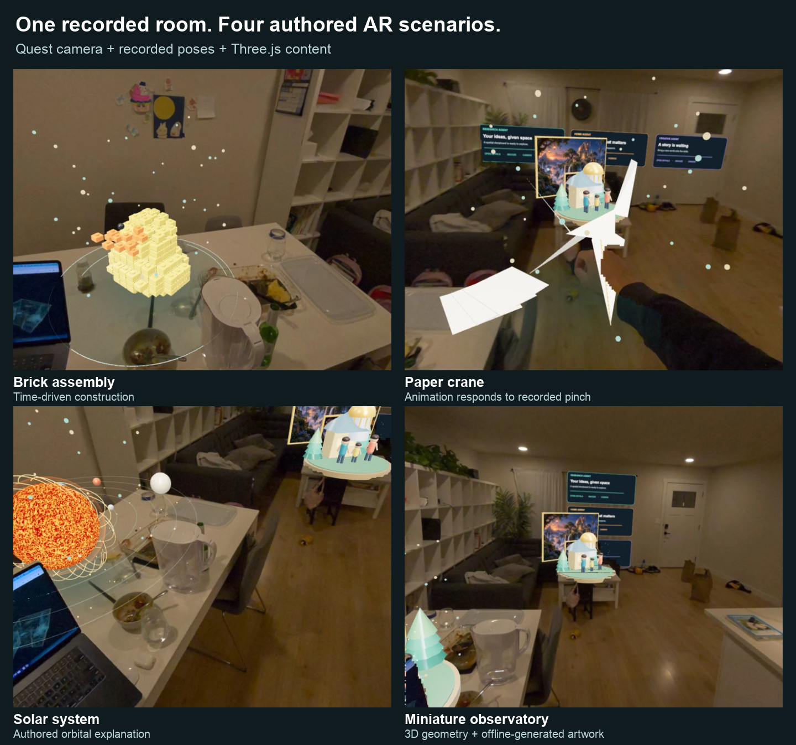

# Demo figure sources — October 2, 2026

The repository overview now uses the latest real-recording demonstrations. The older synthetic preview remains available at `../digital-twin-preview.png` for historical comparison.

## Scenario gallery

Source: `living-room-scenarios.mp4`, exported from private Quest take `20261002_215403`. The video has a 15 fps presentation timeline; the underlying camera has approximately 9.6 unique observations per second.

| Panel | Export frame (zero-based) | Export time | Source frame (zero-based) | Source time |
| --- | ---: | ---: | ---: | ---: |
| Brick assembly | 142 | 9.4667 s | 110 | 9.417413 s |
| Paper crane | 600 | 40.0000 s | 451 | 39.945335 s |
| Solar system | 900 | 60.0000 s | 616 | 59.903699 s |
| Miniature observatory | 1260 | 84.0000 s | 815 | 83.944640 s |

Only the export's title and footer were cropped; the full horizontal scene was retained, resized, and assembled with external panel captions. Scene pixels were not generated or retouched for these figures.

Brick construction is time-driven. Valid recorded pinch flags drive crane animation; its presentation is camera-relative, not verified palm anchoring. The miniature combines executable 3D geometry and offline-generated background artwork. Notification text is illustrative. These frames do not establish live AI orchestration or quantitative physical alignment.

## Editor images

Source: Ryo's `Screen Recording 2026-10-02 at 10.36.20 PM.mov`, posted to [#daily-demo](https://programmable-reality.slack.com/archives/C08RK4K26AV/p1791002447977319), Slack file `F0C6F9DDAM8`. Stills at 2 and 10 seconds show the same recorded source frame (1/915) before and after translation and scale edits. Browser chrome was removed and the application views resized. This is a user screen recording, separate from the paced automated interaction capture described in the reproduction guide.

[Machine-readable source hashes, extraction times, crop rectangles, and output hashes](provenance.json) accompany the images. Original videos, audio, room geometry, and full capture bundles remain outside Git. These selected stills are included in the private repository at the owner's request.
